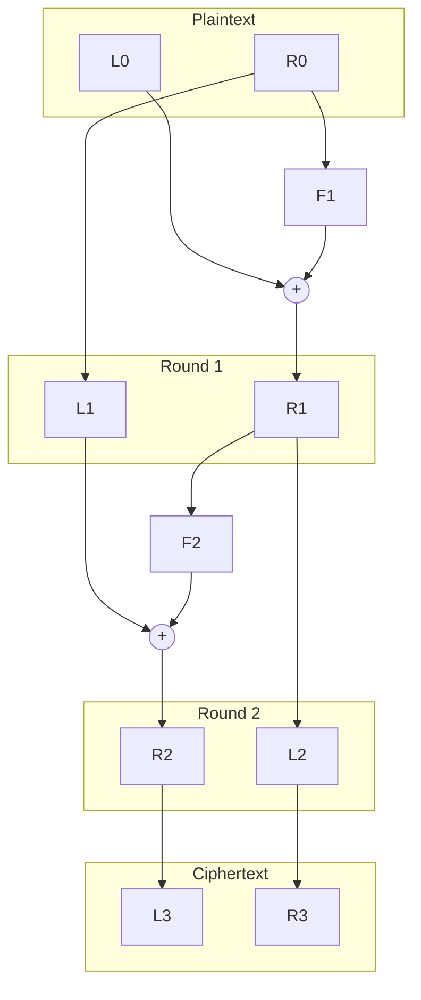

# Feistel cipher

## Background
Feistel ciphers are a method for building a [[symmetric key]] [[block cipher]]. Most modern symmetric block ciphers are based on some sort of Feistel network or something related.

### Encryption
Encryption and decryption are preformed in multistage rounds. The input into a round is split into two chunks `L0` and `R0`. `R0` is passed into some cryptographic function, then XOR'd with `L0`, resulting in `R1`. `L1` is simply `R0`. This process is repeated on `L1` and `R1` to produce `L2` and `R2`, but perhaps with a different cryptographic function.

There can be any number of rounds. The encryption comes from the fact that the functions `F1`, `F2`, ..., `FN` are dependent on subkeys `K1`, `K2`, ..., `KN`, and those subkeys are changed between pairs of users.

The following Mermaid diagram shows how these rounds work for a simple example.


### Decryption
Decryption itself is exactly the same as encryption, except the order of the nonlinear functions is flipped. So if you used `F1`, `F2`, `F3` in the encryption process, to decrypt you would instead used `F3`, `F2`, `F1` in that order. This works even if one-way hashes are used in the encryption process, like HMAC algorithms. Simply put the ciphertext in what was the plaintext box for the encryption algorithm, and the plaintext will appear in the ciphertext box at the end.

This has to due with the XOR operation being reversible. The structure of the Feistel network ensures that we can always apply the appropriate XOR operation at each round, slowly undoing the encryption operation round by round until we get to the end. #neat

## About this Implementation
### Usage
To use this, compile it and use it on your command line. You specify an input file with `-i`, an output file with `-o`, the mode `enc` (encrypt) or `dec` (decrypt) with `-m`, and the file that stores the keys used for encryption and decryption with `-k`. For example, to encrypt the file `0plaintext.txt` with the keys in `keys.txt`, use

```
.\feistel.exe -i="0plaintext.txt" -o="0encrypted.bin" -k="keys.txt" -m="enc"
```

To decrypt, change the respective filenames and the mode to "dec". For example,

```
.\feistel.exe -i="0encrypted.bin" -o="0decrypted.txt" -k="keys.txt" -m="dec"
```

Note that during decryption, any trailing zero bytes will be removed. This was so that I could input simple text files and get a valid text file out.

#### Key File
The keys file is simply a text file of base64, line-separated keys that are used in the HMAC function. These can be arbitrary length. There can be up to `maxkeys` lines in the file. I arbitrarily set this limit to 16.

Note that a blank line at the end will result in an additional round, with no key used in the HMAC function.

Create a new set of keys for each of your friends. Just don't use the ones I provided :)

### Dependency Between Blocks
I added two main features to the ones listed above. The first is that successive blocks depend on the output of prior blocks. This is so that if you, say, want to encrypt a long sequence of 0's, each block will have a different input, and therefore a wildly different output. This is done by XORing the left and right with each other, and using that as input to the right hand side. By XORing the two halves, the original outputs can still be determined when decrypting between successive blocks by XORing again.

### Added Entropy
Using the same set of keys on the same message will produce the same ciphertext. This isn't great. To avoid this, I prepend a certain number of random bytes to the message prior to encryption. This prevents the same ciphertext from being produced.

# Disclaimer
I put this together in a couple of hours. You probably should stick to encryption schemes that weren't developed by someone who watched a Computerphile video and decided to try his hand at programming one. But that's up to you.

# Related
[Computerphile video](https://www.youtube.com/watch?v=FGhj3CGxl8I)
[Wikipedia article](https://en.wikipedia.org/wiki/Feistel_cipher)
